# Accu.Tuning

## 1. Accu.Tuning 개요

### 1.1. Accu.Tuning 소개 및 주요기능

Accu.Tuning은 사용자 친화적인 툴을 사용하여 직접 모델을 학습하거나, 자동화 기능을 사용하여 높은 성능의 모델을 편리하게 탐색하는 솔루션입니다. 데이터 분석 전문가가 아니더라도 사용할 수 있는 Accu.Tuning을 통해 다양한 알고리즘과 하이퍼파라미터를 빠르게 적용해볼 수 있습니다. 복잡한 데이터 분석에 소요되는 시간은 줄이고, 분석 성능은 높여보세요.

AutoML : 자동 HPO 튜닝 기능을 통해 최적의 성능을 내는 ML/DL 모델을 찾을 수 있습니다.

## 2. 시작하기

### 2.1. 사용가능한 컨테이너 자원 확인하기

Accu.Tuning에서 수행하는 일부 작업은 도커 컨테이너에 연결하여 해당 컨테이너 내부에서 작업을 수행 합니다. 따라서, 다음 작업을 수행하기 위해서는 사용가능한 컨테이너 자원이 있는지(1개 이상) 확인하여야 합니다.

- 새 Experiment 만들기
- 탐색적 데이터 분석 수행하기
- 전처리 수행하기
- AutoML 실행하기
- 모델 평가 하기
- 배포하기
- 예측하기

본 메뉴얼에 표시가 있는 사항은 컨테이너 자원이 필요한 작업입니다.

## 3. Supervised
### 3.1. Experiment 목록 확인하기

Experiment란 사용자가 분석하고 싶은 하나의 과제를 의미합니다. Supervised를 시작하기 위해, 가장 먼저 필요한 작업은 새로운 Experiment를 생성하는 것입니다. 한 Experiment에는 하나의 Data Source를 추가할 수 있습니다. 

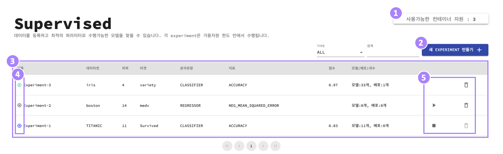

① 사용가능한 컨테이너 자원을 확인합니다.

② 새로운 Experiment를 생성합니다. 

③ 현재 생성되어 있는 Experiment 항목들을 볼 수 있습니다.

④ Experiment의 상태를 나타냅니다. 검정색은 READY, 파란색은 LEARNING, 녹색은 FINISHED를 나타내며, 마우스를 가져대면 Text tooltip으로도 나타납니다. 

⑤ 생성된 Experiment를 시작/중지/삭제 를 할 수 있습니다.

### 3.2. 새 Experiment 생성하기

사용자가 가지고 있는 데이터 파일을 Accu.Tuning으로 업로드하여 새 Experiment를 생성합니다. Supervised에서 지원하는 데이터파일의 확장자는 csv, tsv, txt, xls, xlsx 입니다.

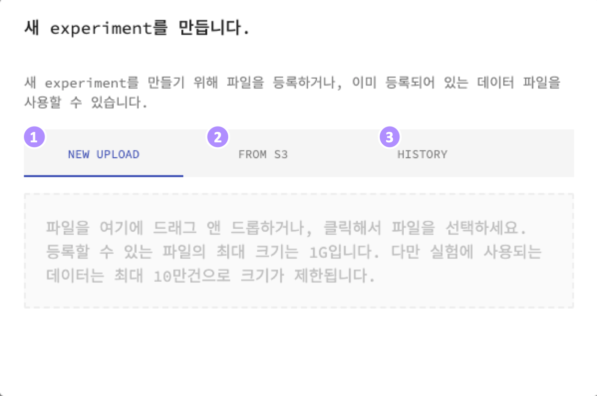

① 로컬 파일을 드래그 앤 드롭하거나, 클릭해서 새 Experiment를 생성할 수 있습니다. 

② 사전에 설정한 S3 bucket에서 데이터를 가져온 후 새 Experiment를 생성할 수 있습니다. 

③ 최근 사용한 파일을 불러와서 Experiment를 생성할 수 있습니다. 

## 3.3 AutoML 실행하기

① [AutoML 옵션설정](#3.3.1-AutoML-옵션-설정하기)과 [컬럼별 설정 및 분포 확인하기](#3.3.2-컬럼별-설정-및-분포-확인하기), [데이터 미리보기](#3.3.3-데이터-미리보기), [탐색적 데이터 분석](#3.3.4-탐색적-데이터-분석(EDA)-수행하기) 등을 수행한 후 RUN AUTOML버튼을 클릭하여 AutoML을 실행할 수 있습니다.

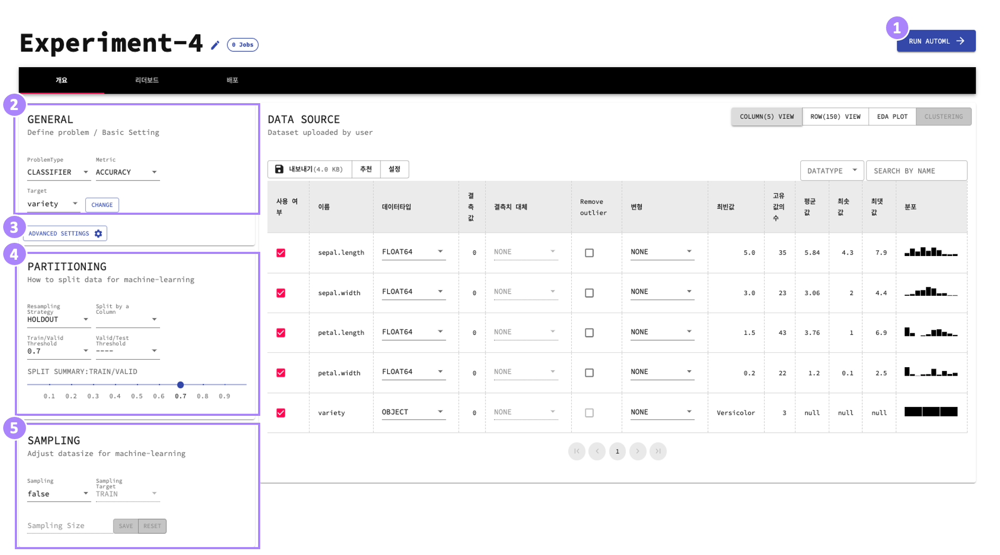

### 3.3.1 AutoML 옵션 설정하기

② 일반 설정 : ProblemType, Metric, Target을 설정 합니다. 이 사항만 설정해도 AutoML을 실행할 수 있습니다.

- ProblemType : 해결하고자 하는 문제 유형
- Metric : 모델을 평가할 때 쓰이는 기준
- Target : 예측하고자 하는 컬럼

③ 고급 설정 : AutoML 고급설정을 이용해서 사용자가 원하는 실험을 더 정교하게 구성할 수 있습니다. ([3.3.1.2 고급 설정 하기](#3.3.1.2-고급-설정-하기) 참고)
 
④ 데이터 분할 : train/valid/test data의 분할 방법을 선택합니다.
 - Resampling Strategy : 데이터셋에서 반복적으로 표본을 추출하여 모델을 생성하고 생성된 모델에 대한 추가적인 정보를 얻는 방법에 대한 설정입니다. 
    - holdout : 데이터셋을 train/validation/test 데이터로 분할합니다. 무작위 분할을 기본으로 하며, 특정 컬럼 값의 범위를 기준으로 분할을 할 수도 있습니다.
    - cv : 교차검증(Cross Validation)을 의미합니다. 데이터셋을 서로 다른 부분 집합(fold)로 분할하여 모델을 평가하고 여러 개의 모델의 지표를 얻습니다.
 - Folds(cv 선택시 활성화) : 데이터셋을 분할하는 서로 다른 부분 집합(fold)의 수
 - Train/Valid Threshold(holdout 선택시 활성화) : train/valid 데이터의 비율
 - Valid/Test Threshold(holdout 선택시 활성화) : valid/test 데이터의 비율
 - SPLIT SUMMARY: 사용자가 선택한 train/valid/test 데이터 시각화(화면내 조정 가능)

⑤  데이터 샘플링 : AutoML에 사용될 데이터의 수를 조정할 수 있습니다.
 - Sampling : 샘플링을 수행할 지 여부
 - Sampling Target : train 데이터 혹은 전체 데이터를 샘플링할지 결정
 - Sampling Size : 샘플링을 통해 최종적으로 얻어지는 행의 수. 기존 행의 수보다 크게 설정할 경우 기존과 비슷한 분포를 가지는 가상의 데이터를 생성하여 추가합니다. (자체 딥러닝 기술 이용)
 - Use class-balancer : Sampling이 true일 경우에만 활성화.([3.3.1.1. class balancer 사용하기](#3.3.1.1-class-balancer-사용하기) 참고)

#### 3.3.1.1 class balancer 사용하기 
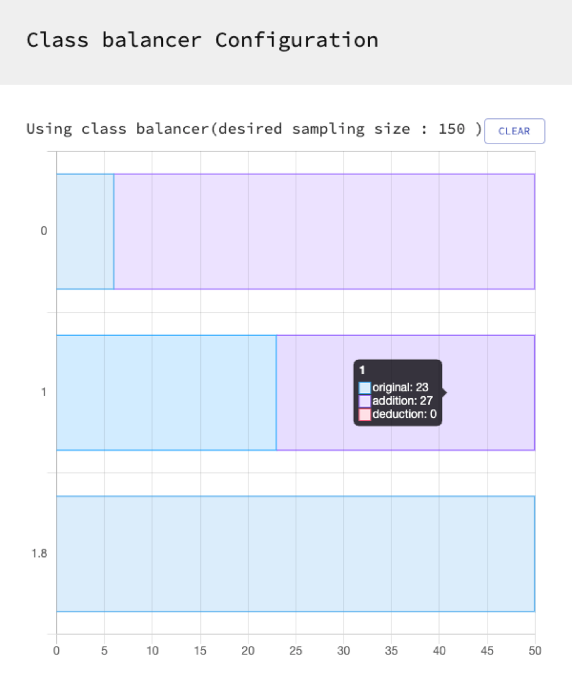
 - 클릭한 클래스의 행의 수를 기준으로, 다른 클래스의 행의 수를 줄이거나 늘려 행의 수를 똑같이 맞춥니다.

#### 3.3.1.2 고급 설정 하기
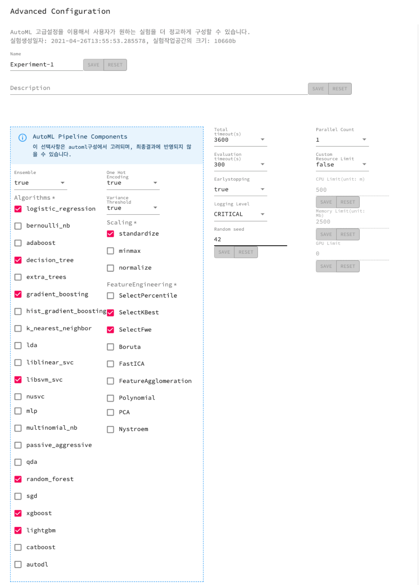
- Name : 실험명을 변경합니다.
- Description : 실험에 대한 상세 설명
- AutoML Pipeline Components : AutoML 구성과정에서 고려되며, 최종결과에 반영되지 않을 수 있습니다.
    - Ensemble : true로 설정 시, 앙상블 기법을 사용합니다. 앙상블 기법이란, 여러 개의 모델의 예측결과를 종합해 최종 예측 결과를 도출하는 기법입니다.
    - Algorithms : 최적화 탐색에 사용할 알고리즘 목록을 선택할 수 있습니다. 개별 알고리즘에 대한 설명은 [지원하는 모델 알고리즘](./model.md) 페이지를 참고하세요.
    - One Hot Encoding : true로 설정 시, experiment에서 feature로 사용되는 카테고리 혹은 Object 컬럼(텍스트 등)에 대해 one-hot 인코딩을 실시합니다.
    - Variance Threshold : true로 설정 시, 전처리 과정에서 분산이 일정 수준 이하 (기본값 0)인 feature들을 찾고, 이러한 예측력이 낮거나 없는 feature들을 삭제합니다.
    - Scaling : 전처리 과정에서 선택한 방법으로 전체 feature를 스케일링하거나 표준화함으로써, 특정 모델에서 더 나은 결과를 도출할 수 있습니다.
        - standardize :각 feature값에서 평균을 뺀 후에 표준편차로 나누어 평균 0, 표준편차 1로 변환합니다.
        - minmax : 최소값과 최대값을 먼저 계산하고 이 값을 이용하여 전체 feature값들을 0~1 사이의 값으로 변경합니다.
        - normalize : 최소값이 0, 최대값이 1이도록 데이터셋을 변경합니다.
    - feature Engineering : feature 선택과 차원 축소 등을 포함하며 고차원의 데이터셋에 대한 성능을 개선하기 위해 사용됩니다.
        - SelectPercentile : 점수가 높은 상위 비율의 feature만을 선택합니다.
        - SelectKBest : 점수가 높은 k개의 feature만을 선택합니다.
        - SelectFwe: family-wise 에러 비율이 낮은 feaure를 선택합니다.
        - Boruta : boruta 라이브러리를 사용하여 feaure를 선택합니다. 자세한 사항은 [여기](https://github.com/scikit-learn-contrib/boruta_py)를 참고하세요.
        - FastICA : 독립 성분 분석(Fast Independent Component Analysis)을 통해 feature의 수를 줄입니다.
        - FeatureAgglomeration : feature들을 합쳐서 feature의 수를 줄입니다.
        - Polynomial : 교차곱(interaction)을 통해 feature의 수를 늘립니다.
        - PCA : 주성분 분석(Principal Component Analysis)으로 feature를 줄입니다.
        - Nystroem : Kernel approximation을 통해 데이터셋을 변형합니다.
- Total Timeout : AutoML 동작에 대한 시간 제한(단위: 초)
- Evaluation timeout : 한 evaluation에 사용되는 최대 시간을 의미합니다.
- Earlystopping : true로 설정 시, 특정 횟수의 모델링 시행 동안 최고 점수가 개선되지 않는 경우에 AutoML을 중지합니다.
- Logging Lebel : 실험 수행시에 기록되는 로그의 수준을 조정합니다. 로그레벨이 낮을 수록 성능에 영향을 끼칠 수 있습니다.
- Random seed : 난수값은 실험에서 사용되는 무작위값에 대한 시드값을 조정해서, 다른 결과를 만들어내거나 혹은 같은 결과를 만들어낼 수 있습니다.
- Parallel Count : 모델링에 사용할 컨테이너의 수. 컨테이너 개수를 늘릴 경우 고급설정에서 할당한 알고리즘들을 컨테이너 개수만큼 나누어서 동시에 수행하기 때문에, 빠른 시간에 좋은 결과를 얻어낼 수 있습니다. (단 사용가능한 컨테이너 개수가 설정한 컨테이너 개수 이상 남아있어야 합니다.)
- Custom Resource Limit : 사용할 CPU/GPU의 수와 메모리 제한을 설정할 수 있습니다.    


### 3.3.2 컬럼별 설정 및 분포 확인하기

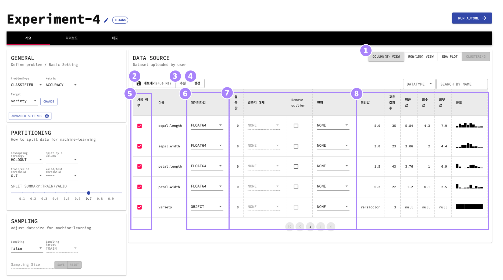

① 데이터 컬럼 테이블을 통해 컬럼별 옵션을 설정하고 분포를 확인할 수 있습니다.

② Experiment에 사용할 데이터를 다운로드 할 수 있습니다.

③ Accu.Tuning의 전처리 옵션을 추천받을 수 있습니다. 

④ 이상치 제거 방법에 대한 상세한 설정을 할 수 있습니다. 

⑤ 각 컬럼을 변수(feature)로 선택하여 모델링에 사용할지를 선택합니다.

⑥ 데이터 타입이 올바르게 입력됬는지 확인하고 변경할 수 있습니다.

⑦ 결측치 대체, 이상치 제거, 변형등을 설정합니다.

⑧ 컬럼별 데이터의 분포를 확인할 수 있습니다.


#### 3.3.3. 데이터 미리보기

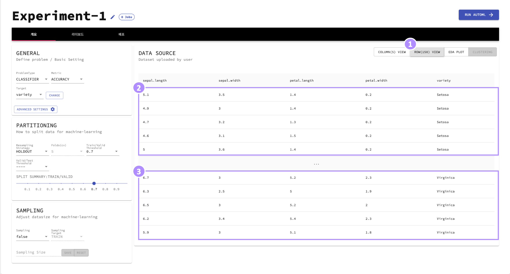

① 데이터를 미리보기 탭으로 이동합니다. 괄호 안에 전체 행의 수를 확인할 수 있습니다.

② 상위 5개 행이 표시됩니다.

③ 하위 5개 행이 표시됩니다.


#### 3.3.4. 탐색적 데이터 분석(EDA) 수행하기

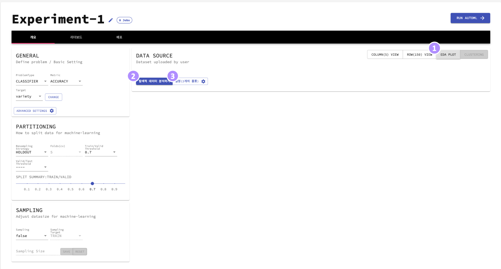

① 탐색적 데이터 분석(EDA) 탭으로 이동합니다.

② 데이터 셋에 대한 플롯을 생성할 수 있습니다. 기본적으로 CORRELATION MATRIX과 PARALLEL COORDINATES가 생성됩니다.

③ 생성을 원하는 플롯 종류를 선택합니다.

- CORRELATION MATRIX : 변수 간의 상관계수를 보여줍니다. 각 셀은 두 변수 간의 상관관계를 나타냅니다. 데이터를 요약하는 상관 행렬은 더 고도의 분석을 실시하기 위한 입력이나 진단 방법으로 활용됩니다.
- PAIR PLOT : 데이터셋의 쌍별 관계를 나타냅니다. Pairplot은 개별 변수의 분포와 두 변수 간의 상관관계를 함께 볼 수 있도록 하며, 변수나 차원 간의 관계나 패턴을 이해하는데 사용됩니다.
- VARIABLE ANALYSIS: 각 변수(feature) 혹은 타깃 값에 대한 분포를 나타냅니다.
- PARALLEL COORDINATES : 데이터셋의 각 행을 각 차원을 나타내는 평행축을 가로지르는 폴리라인으로 나타냅니다. Interactive한 도표이기에 축을 따라 선을 드래그하여 원하는 영역을 필터링할 수 있습니다.

## 3.4 AutoML 결과 확인하기

### 3.4.1. 실시간 점수/알고리즘 확인하기

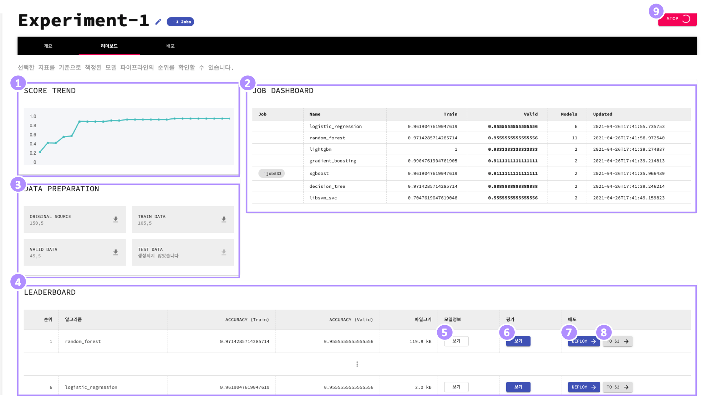

① 알고리즘 점수를 미리보고 실시간 추세를 확인할 수 있습니다.

② 각 컨테이너별로 현재 시도하고 있는 알고리즘에 대한 정보입니다.

③ train/valid/test 데이터의 정보를 확인하고 다운로드할 수 있습니다. 

④ Accu.Tuning 모델의 점수를 내림차순으로 볼 수 있습니다.

⑤ 모델이 생성되는 전과정과 하이퍼파리미터 정보를 확인할 수 있습니다.

⑥ 모델에 대한 평가를 요청할 수 있습니다. ([3.4.2. 모델 평가 확인하기](#3.4.2-모델-평가-확인하기) 참고)

⑦ 최적의 모델을 선택하여 배포합니다.일반적으로 최상단에 위치한 지표가 가장 높은 모델을 선택하는 것이 좋습니다. 배포탭에서 배포가 완료된 모델 정보를 확인할 수 있습니다. 

⑧ 선택한 모델의 binary파일과 전처리 파이프라인을 S3로 내보냅니다.([3.4.3. S3로 모델 배포하기](#3.4.2-S3로-모델-배포하기) 참고)

⑨ AutoML을 종료합니다

### 3.4.2. 모델 평가 확인하기
선택한 모델이 대한 다양한 정보를 확인할 수 있습니다.

- Metrics: AutoML 실행 전 기본적으로 설정한 지표 외에 해당 모델을 평가한 다양한 지표를 확인 할 수 있습니다.

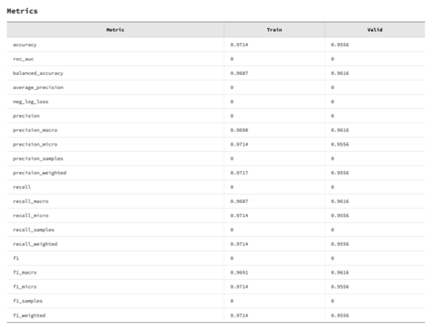

- 플롯: 모델을 평가하는 다양한 플롯을 생성할 수 있습니다. 기본값으로 Permutation Feature Importance 가 생성됩니다. 
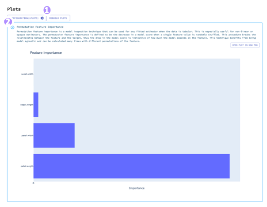

 ① 생성을 원하는 플롯 종류를 선택합니다.
 
 ② 선택한 플롯을 다시 그립니다. 
 
### 3.4.3. S3로 모델 배포하기
 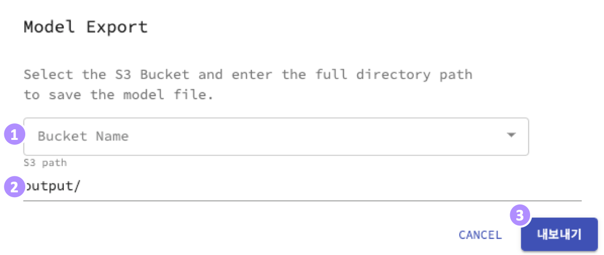
 
 ① 저장할 S3 버켓명을 선택합니다.
 
 ② 버켓 내부에 저장할 절대경로를 입력합니다. 
 
 ③ "내보내기"를 클릭하여 내보냅니다. 


## 3.5. 배포한 모델 사용하기

### 3.5.1. 배포모델을 비교/관리하기

여려 개의 배포모델을 비교하고 관리할 수 있습니다.

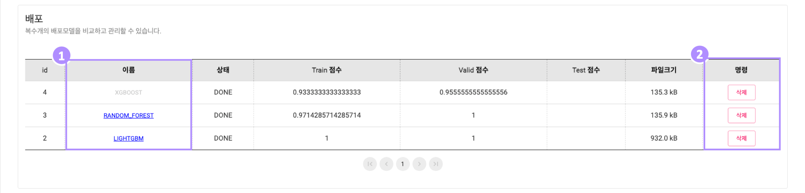

① 배포된 모델 중 상세 정보를 표시할 모델을 선택합니다.

② 배포된 모델을 삭제합니다.


### 3.5.2. 배포 모델 다운로드 후 사용하기

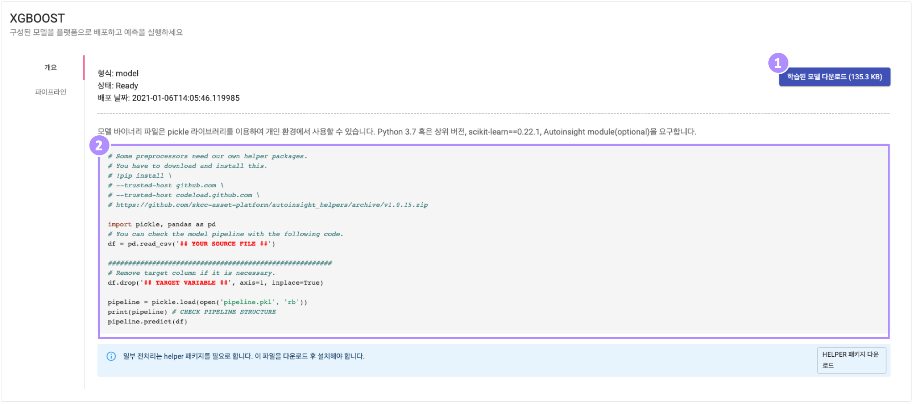


① 배포된 Binary 파일을 다운로드 합니다.

② 소스코드 복사후 '## YOUR SOURCE FILE ##'에 Binary 파일의 경로를 , '## TARGET VARIABLE ##'에 타깃 컬럼의 이름을 입력합니다.

- 일부 전처리는 accutuning_helpers 패키지를 필요로 합니다. 아래 명령어를 통해 accutuning_helpers 패키지를 설치할 수 있습니다.
```
pip install \
--trusted-host github.com \
--trusted-host codeload.github.com \
https://github.com/AIIP-DEV/accutuning_helpers/archive/v1.0.28.zip
```

### 3.5.3. 배포 모델 파이프라인 확인하기

배포 모델에 대한 파이프라인 정보를 확인할 수 있습니다. 

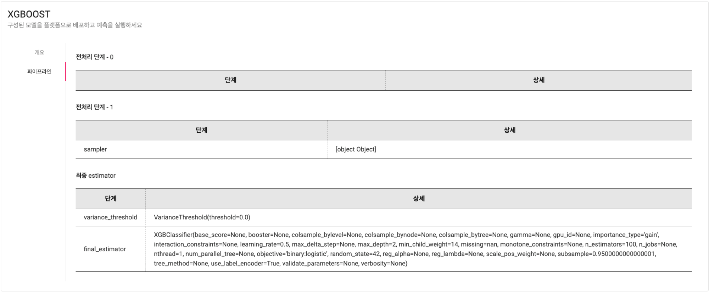


### 3.5.4. 예측 수행하기

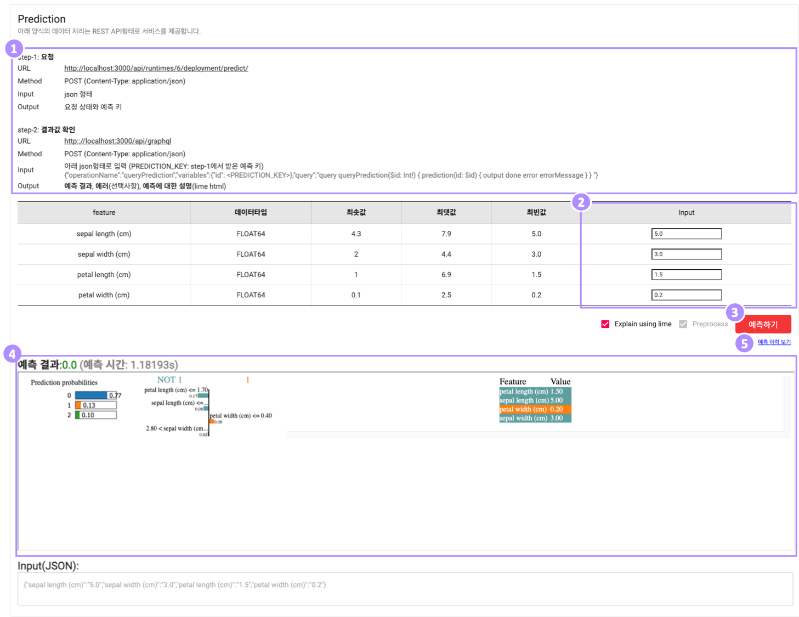

#### 3.5.5. API를 통한 예측 수행

① 기재된 URL, Method, Input을 활용하여 API를 통해 예측을 수행할 수 있습니다.

#### 3.5.6. 화면에서 간단한 예측 수행

② 각 컬럼에 해당하는 input값을 입력합니다. 기본값으로 최빈값이 입력됩니다.

③ 예측을 수행합니다.

④ 예측 결과와 함께 예측에 대한 설명을 확인합니다.

⑤ 과거 예측 이력을 조회할 수 있습니다.
